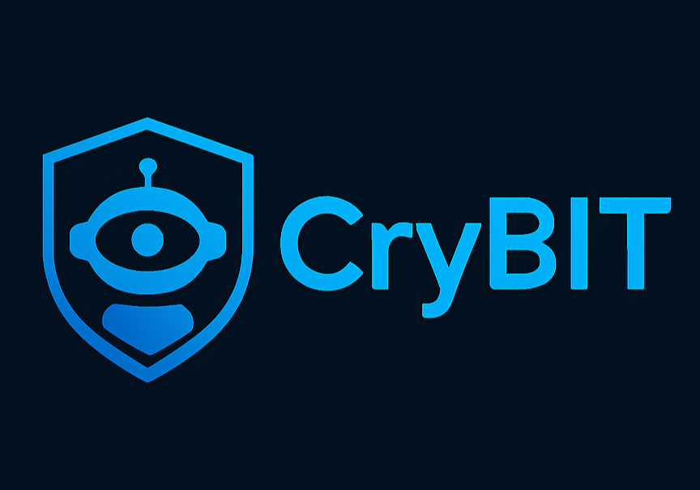

# 🚨 CryBIT - AI-Powered Real-Time Scam Detection System

CryBIT is an advanced **AI-powered scam detection system** that monitors Telegram channels in **real-time** to detect and flag **cryptocurrency scams**, **phishing attempts**, **blacklisted wallets**, and **fraudulent messages** using **ML, NLP, and rule-based heuristics**.




## 🔧 Tech Stack

- **Backend**: Flask (Python)
- **Telegram Integration**: Telethon
- **Database**: MongoDB
- **AI Modules**: Scikit-learn, Transformers, EasyOCR
- **Frontend**: HTML, AJAX (for dynamic UI)


## ⚙️ Features

- Real-time message monitoring via Telethon
- Multi-layered scam detection (ML, NLP, OCR, URL & Wallet checks)
- Cumulative risk scoring system
- Dashboard UI to manage channels and view flagged messages
- Telegram alerts for high-risk scams
- Modular architecture for scalability and maintenance


## 🛠️ Setup Instructions

### 1. 📦 Prerequisites

Ensure you have the following installed:

- Python 3.8+
- MongoDB (running locally or via Atlas)
- `pip` (Python package manager)

### 2. 🔑 Configuration

Create or update the `config.json` file with the following structure:

```json
{
  "api_keys": {
    "google_safe_browsing": "YOUR_API_KEY",
    "phish_tank": "YOUR_API_KEY"
  },
  "telegram": {
    "api_id": "YOUR_API_ID",
    "api_hash": "YOUR_API_HASH",
    "bot_token": "YOUR_BOT_TOKEN",
    "admin_id": "YOUR_TELEGRAM_ID"
  },
  "scam_keywords": ["free bitcoin", "investment", "double your money"],
  "risk_threshold": 0.4
}
```


### 3. 📥 Install Dependencies

```bash
pip install -r requirements.txt

```

> If requirements.txt is missing, install dependencies manually:
> 

```bash
pip install flask telethon pymongo scikit-learn sentence-transformers easyocr

```

## 🚀 Running the App

Use a **split terminal** or two terminal tabs:

### Terminal 1: Start Flask Backend

```bash
python main.py

```

### Terminal 2: Start Telegram Monitoring

```bash
python telethon_integration.py

```

Open your browser and visit: [http://localhost:5000](http://localhost:5000/)


## 📊 Risk Scoring Breakdown

| Detection Technique | Weight Added |
| --- | --- |
| ML Model Prediction | +0.6 |
| Keyword Match | +0.5 |
| Phishing URL Detected | +0.6 |
| Crypto Wallet Blacklist Match | +0.7 |
| NLP Embedding Match (Semantic) | +0.2 |
| OCR-based Scam Text Detection | +0.3 |

> Messages are flagged if the total risk score > 0.4 (default threshold).
> 


## 🙌 Contribution Guidelines

### 🔧 Want to Contribute?

We welcome contributions from developers!

### 📌 Here's how you can help:

- Improve scam detection accuracy (enhance ML models or NLP logic)
- Add support for more scam patterns or keywords
- Refactor code for modularity and scalability
- UI/UX improvements for the dashboard
- Write documentation or create test cases

### 🛠️ To Contribute:

1. Fork this repository
2. Create a new branch (`feature/your-feature-name`)
3. Commit your changes with clear messages
4. Push to your branch and create a Pull Request

---

## 🧠 Future Enhancements

- Admin login & access control
- Visual scam heatmaps & statistics
- PDF export of scam reports
- Multilingual support
- Integration with Discord, WhatsApp, etc.

---

## 📬 Contact

For support, questions, or collaboration:

📧 **Email**: [mukeshkumar.cse24@gmail.com]

---

## 📄 License

This project is licensed under the MIT License.

