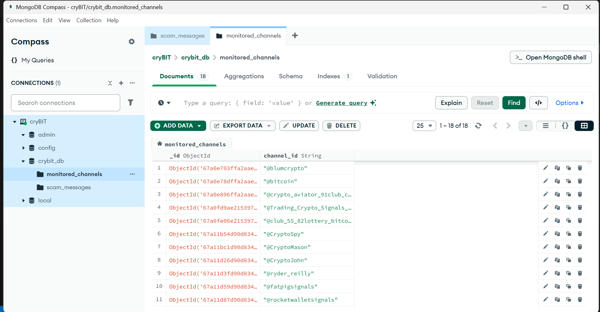
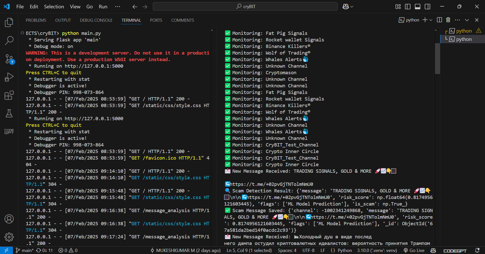
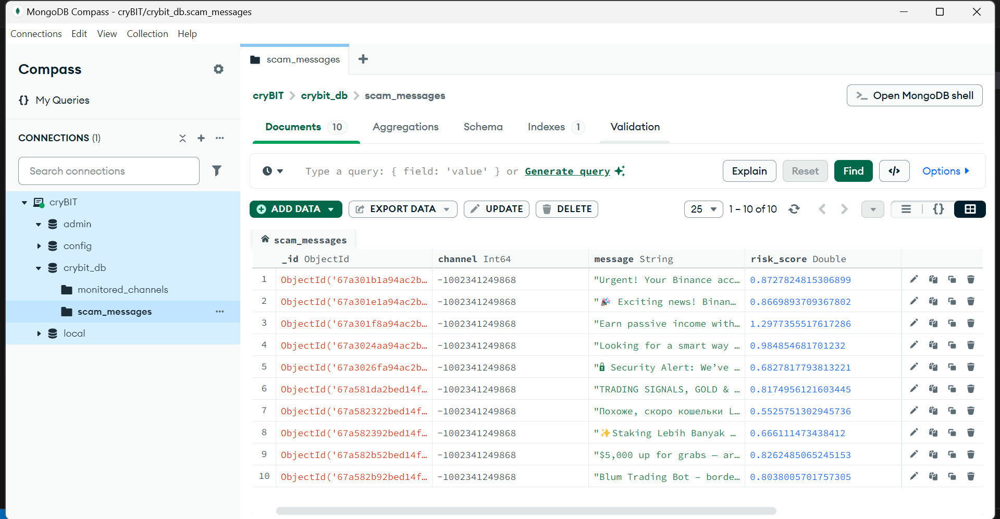
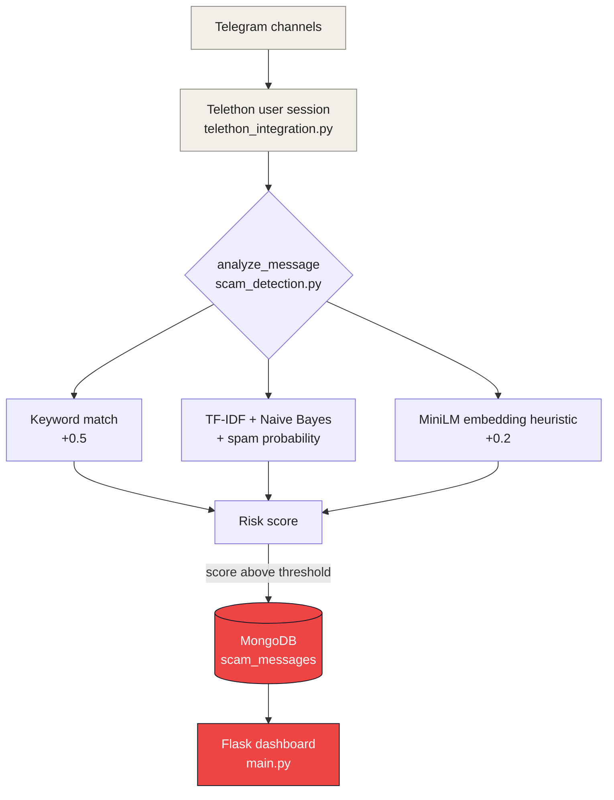

<div align="center">


<a href="#-detection-pipeline"></a>

<br/>

[](https://www.python.org)
[](https://flask.palletsprojects.com)
[](https://docs.telethon.dev)
[](https://www.mongodb.com)
[](https://scikit-learn.org)
[](https://pytorch.org)
[](https://www.sbert.net)
<br/>
[](#-status-and-known-limitations)
[](#-license)

</div>

---

##  Project Overview

CryBIT watches Telegram channels through a **Telethon user session**, scores every incoming message with a small stack of detectors (keyword match, a TF-IDF + Naive Bayes classifier, a sentence-embedding heuristic) and stores flagged messages in **MongoDB**. A **Flask dashboard** lets you manage the monitored channels, browse flagged messages and inspect their risk scores.

It was built in February 2025 as a hackathon-style prototype and last touched in April 2025. The core loop (listen, score, store, show) works. Several features described in the original plan were never wired in; see [Status and known limitations](#-status-and-known-limitations).

### Key Features

-  **Live monitoring**: a Telethon client receives new messages and scores each one as it arrives.
-  **Layered scoring**: keyword hit (+0.5), Naive Bayes spam probability (added as-is), and a semantic-embedding heuristic (+0.2) are summed into one risk score.
-  **Dashboard**: pages for flagged messages, logs, channel management, per-message analysis and settings.
-  **Persistence**: flagged messages and the monitored-channel list live in MongoDB (`crybit_db`).
-  **Ready-trained model**: the trained classifier and vectorizer are committed, so it runs without retraining.

##  Screenshots

| Monitored channels | Fetching messages | Flagged messages |
|---|---|---|
|  |  |  |

##  Detection Pipeline


```mermaid
flowchart TD
    A[Telegram channels] --> B[Telethon user session<br/>telethon_integration.py]
    B --> C{analyze_message<br/>scam_detection.py}
    C --> D[Keyword match<br/>+0.5]
    C --> E[TF-IDF + Naive Bayes<br/>+ spam probability]
    C --> F[MiniLM embedding heuristic<br/>+0.2]
    D --> G[Risk score]
    E --> G
    F --> G
    G -->|score above threshold| H[(MongoDB<br/>scam_messages)]
    H --> I[Flask dashboard<br/>main.py]

    classDef src fill:#F1EFE8,stroke:#888780,color:#222
    classDef det fill:#EEEDFE,stroke:#7F77DD,color:#222
    classDef out fill:#EF4444,stroke:#111827,color:#fff
    class A,B src
    class C,D,E,F,G det
    class H,I out
```

| Detector | Weight | Where |
|---|---|---|
| Keyword list (configurable) | +0.5 | `scam_detection.py` |
| Multinomial Naive Bayes on TF-IDF (5,000 features) | + predicted spam probability | `scam_detection.py`, `train_model.py` |
| `all-MiniLM-L6-v2` embedding mean above 0.1 | +0.2 | `scam_detection.py` |

A message is stored when its total score exceeds `scam_detection.risk_threshold` from the config file.

##  Requirements

- Python 3.8+
- MongoDB running locally (`localhost:27017`)
- A Telegram API app (`api_id` and `api_hash` from [my.telegram.org](https://my.telegram.org))
- Internet access on first run, to download the `all-MiniLM-L6-v2` and EasyOCR models

##  Quick Start

### Installation

```bash
git clone https://github.com/mukesh-dev-git/CryBIT-1.0.git
cd CryBIT-1.0

python -m venv venv
source venv/bin/activate  # On Windows: venv\Scripts\activate

pip install -r requirements.txt
```

> `requirements.txt` also lists standard-library modules (`json`, `os`, `re`, `time`, `asyncio`). Remove those lines if `pip` complains.

### Configuration

Create `config.json` in the project root. It is listed in `.gitignore`, so keep it that way and never commit it.

```json
{
  "mongodb": { "host": "localhost", "port": 27017, "database": "crybit_db" },
  "telegram": { "api_id": 0, "api_hash": "YOUR_API_HASH", "admin_id": 0 },
  "ml_model": { "model_path": "ml_model.pkl" },
  "scam_detection": {
    "risk_threshold": 0.4,
    "scam_keywords": ["free bitcoin", "giveaway", "double your money"]
  },
  "api_keys": { "google_safe_browsing": "", "scam_wallet": "" }
}
```

### Run

Open two terminals:

```bash
# Terminal 1: dashboard at http://localhost:5000
python main.py

# Terminal 2: Telegram listener (first run asks for your phone number and login code)
python telethon_integration.py
```

The first run creates `user_session.session`, which is a **logged-in Telegram session**. It is gitignored. Treat it like a password and never commit or share it.

### Retrain the classifier (optional)

```bash
python train_model.py   # reads cleaned_dataset.csv, writes ml_model.pkl and vectorizer.pkl
```

##  Project Structure

```
CryBIT-1.0/
├── main.py                  # Flask app and dashboard routes
├── telethon_integration.py  # Telegram listener, calls analyze_message
├── scam_detection.py        # keyword + ML + embedding scoring
├── train_model.py           # trains TF-IDF + Naive Bayes
├── database.py, utility.py  # MongoDB helpers and config loader
├── mongodb.py, test.py      # scratch scripts for manual DB checks
├── templates/, static/      # dashboard pages and styles
├── dataset.csv, cleaned_dataset.csv
├── ml_model.pkl, vectorizer.pkl, processed_data.pkl
└── Screenshots/
```

##  Status and Known Limitations

This is a prototype. What is and is not in place:

| Area | State |
|---|---|
| Live message scoring and storage | Working |
| Dashboard: channels, flagged messages, logs | Working |
| Manual `/scan` page | Placeholder: returns a fixed result, not a real score |
| Settings page | Edits the in-memory config only; changes are not saved |
| URL phishing check (Google Safe Browsing) | Function written, never called |
| Wallet blacklist check | Function written, never called |
| OCR on images (EasyOCR) | Function written, never called |
| Telegram alerts to the admin | Function written, never called |
| Channel filtering | The listener handles all new messages, not only the monitored channels |
| Authentication, tests, deployment | Not implemented |

### External services

| Service | Used for | Needed to run? |
|---|---|---|
| Telegram API and a user session | Reading channel messages | Yes |
| MongoDB (local) | Storing flagged messages and channels | Yes |
| Hugging Face and EasyOCR model downloads | Embedding and OCR models | Yes, on first run |
| Google Safe Browsing API | URL checks | No (code path unused) |
| Scam-wallet lookup API | Wallet checks | No (code path unused) |

##  Ideas for Next Steps

- Wire the URL, wallet, OCR and alert functions into `analyze_message`
- Restrict the listener to the monitored channel list
- Load secrets from environment variables instead of a JSON file
- Persist settings and add a login page

##  License

MIT.

<div align="center">


</div>
